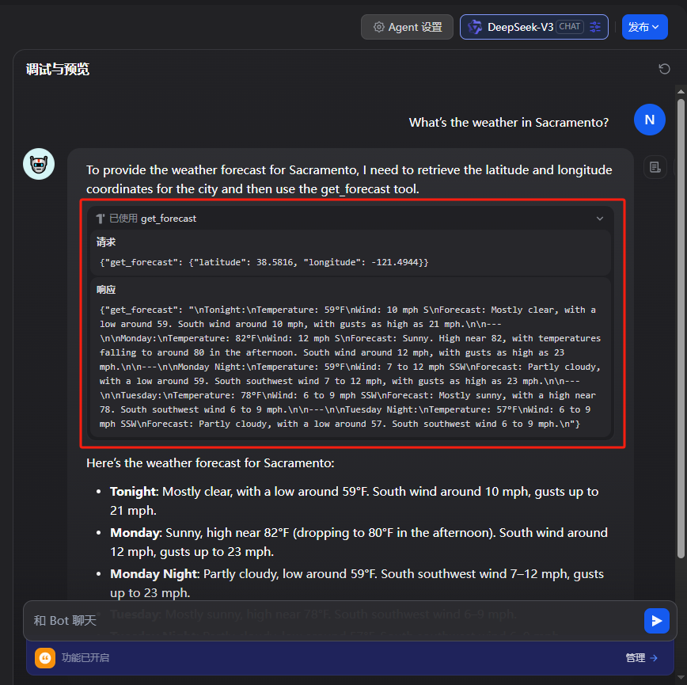

# MCP 学习笔记

## 一、MCP概述

### MCP 简介

**Model Context Protocol（MCP）** 是一个开放协议，标准化了应用程序如何向大型语言模型（LLM）提供上下文。它就像 AI 世界的 USB-C 接口，使不同的客户端和数据源/工具之间能无缝连接。

### MCP 架构

MCP 使用客户端-服务器架构：


- MCP Host：如 Claude 桌面应用、IDE 或 AI 工具
- MCP Client：连接 MCP 服务器的客户端协议
- MCP Server：通过**标准协议**暴露能力的小型服务
- 本地资源：本机上的文件、数据库、服务
- 远程服务：互联网上的 API 等外部系统

###  核心组件

1. Protocol 层（协议层）

    负责高层通信逻辑：请求/响应、通知、消息解析等。

2. Transport 层（传输层）

    用于 Client ↔ Server 间的底层通信，支持两种机制：

    - Stdio: 本地进程通信，适合桌面/插件类应用
    - Streamable HTTP: 远程通信，支持 HTTP POST + Server-Sent Events（SSE）
    
    所有传输统一使用 JSON-RPC 2.0 协议格式。

### MCP Server

- Tool：供模型调用的功能接口
    
    ```ts
    {
      name: string, // 工具名（唯一）
      description?: string, // 描述信息（可选）
      inputSchema: { type: "object", properties: { ... } }, // 参数结构
      annotations?: { ... } // 工具行为提示
    }
    ```

- Resource：供模型读取的上下文数据
- Prompt：提示词模板
- Sampling：模型生成参数（如 temperature）
- Elicitation：组合资源与提示词生成最终输入
- Root：大模型调用入口节点

### MCP Client

- 工具发现：发送 tools/list 请求获取当前可用工具列表
- 工具调用：使用 tools/call 请求调用指定工具


## 二、Dify 1.6 使用 MCP

### 添加 MCP 类型的工具

点击工具tab，选择MCP，就可以看到添加 MCP 服务按钮


例如，可以引入高德地图的 MCP Server，更多 MCP 可以参考 [MCP 广场](https://www.modelscope.cn/mcp)

```yaml
https://mcp.amap.com/mcp?key=您在高德官网上申请的key
```

填入 URL 后，可以自定义名称、图标以及标识


之后点击添加并授权，dify 会自动识别到该 MCP Server 下所有的工具


### Dify 中使用 MCP Server

1. Agent 中使用
    
    在工具栏中添加需要的工具
   

    之后向 Agent 提问天气相关问题，Agent 就会自动调用 maps_weather 工具，并且根据工具返回内容回答问题
   

2. Chatflow 或者 Workflow 中使用

    点击添加节点，选择工具，选择MCP，之后就可以选择某一个工具作为工作流中的节点
   

### 将 Dify 中的工作流发布为 MCP Server

首先需要先发布工作流，之后点击左侧编排上方的设置区域


接着点击 MCP 服务右侧的开关


然后填写服务描述和参数描述，之后点击启用按钮就成功启用 MCP 服务了


最后复制服务 URL，就可以在 Cursor 等其他 AI 工具中使用这个 MCP 服务了


## 三、开发 MCP Server

首先创建一个 FastMCP：
注意，stateless_http 应设为 True，否则，会报错误：Bad Request: Missing session ID；
host 应设为 0.0.0.0 否则默认的 127.0.0.1 只有本地能访问到。

```python
from mcp.server.fastmcp import FastMCP

# Init
mcp = FastMCP("weather", stateless_http=True, host="0.0.0.0", port=8000)
```

之后，定义一个 tool get_forecast
```python
@mcp.tool()
async def get_forecast(latitude: float, longitude: float) -> str:
    """Get weather forecast for a location.

    Args:
        latitude: Latitude of the location
        longitude: Longitude of the location
    """
    # First get the forecast grid endpoint
    points_url = f"{NWS_API_BASE}/points/{latitude},{longitude}"
    points_data = await make_nws_request(points_url)

    if not points_data:
        return "Unable to fetch forecast data for this location."

    # Get the forecast URL from the points response
    forecast_url = points_data["properties"]["forecast"]
    forecast_data = await make_nws_request(forecast_url)

    if not forecast_data:
        return "Unable to fetch detailed forecast."

    # Format the periods into a readable forecast
    periods = forecast_data["properties"]["periods"]
    forecasts = []
    for period in periods[:5]:  # Only show next 5 periods
        forecast = f"""
{period['name']}:
Temperature: {period['temperature']}°{period['temperatureUnit']}
Wind: {period['windSpeed']} {period['windDirection']}
Forecast: {period['detailedForecast']}
"""
        forecasts.append(forecast)

    return "\n---\n".join(forecasts)
```

最后，启动 FastMCP，注意，transport 应设为 streamable-http，stdio 无法产生服务 URL。

```python
if __name__ == "__main__":
    # Initialize and run the server
    mcp.run(transport='streamable-http')
```

运行效果如图：

