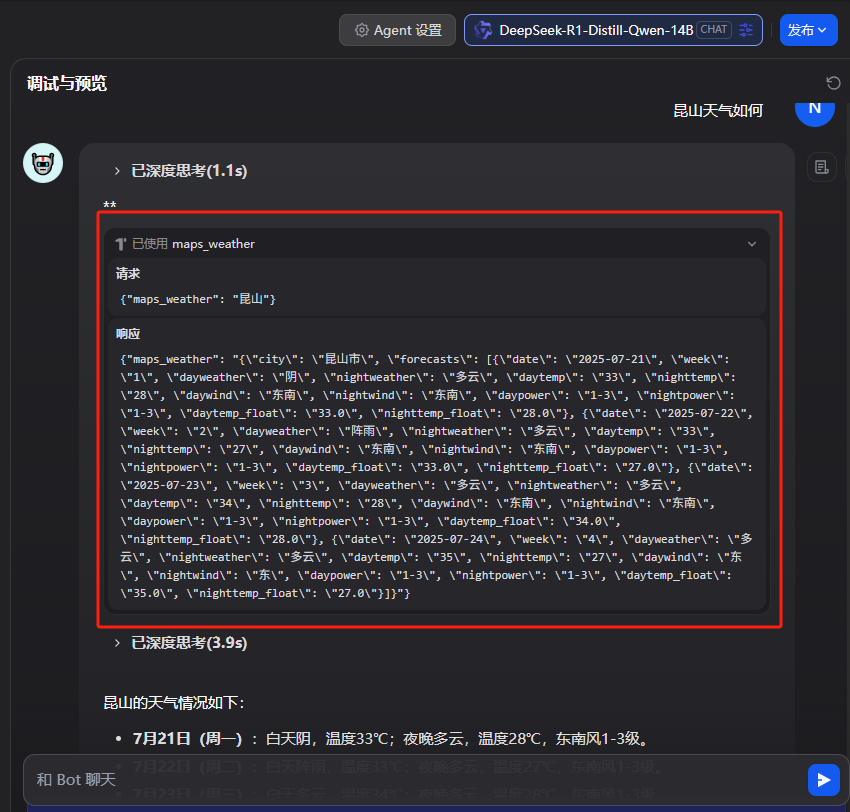

# MCP 学习笔记

## 一、MCP概述

### MCP 简介

**Model Context Protocol（MCP）** 是一种开放协议，用于标准化应用程序向大语言模型（LLMs）提供上下文的方式。你可以把 MCP 想象成 AI 应用的 USB-C 接口。就像 USB-C 为设备连接各种外设和配件提供了统一的标准一样，MCP 也为 AI 模型连接不同的数据源和工具提供了统一的标准接口。

### MCP 架构

MCP 使用客户端-服务器架构：


- MCP Host：通过 MCP 访问数据的 AI 工具，如 Claude Desktop、Cursor 等
- MCP Client：协议客户端，与服务器保持一对一连接
- MCP Server：轻量级程序，通过标准化的 MCP（模型上下文协议）暴露特定功能。
- 本地资源：本机上的文件、数据库、服务
- 远程服务：互联网上的 API 等外部系统

###  核心组件

1. Protocol 层（协议层）

    负责高层通信逻辑：请求/响应、通知、消息解析等。

2. Transport 层（传输层）

    用于 Client ↔ Server 间的底层通信，支持两种机制：

    - Stdio: 本地进程通信，适合桌面/插件类应用
    - Streamable HTTP: 远程通信，支持 HTTP POST + Server-Sent Events（SSE）
    
    所有传输统一使用 JSON-RPC 2.0 协议格式。

### MCP Server

- Tool：供模型调用的功能接口
    
    ```ts
    // 工具定义结构
    {
      name: string, // 工具名（唯一）
      description?: string, // 描述信息（可选）
      inputSchema: { type: "object", properties: { ... } }, // 参数结构
      annotations?: { ... } // 工具行为提示
    }
    ```

- Resource：供模型读取的上下文数据
- Prompt：提示词模板
- Sampling：模型生成参数（如 temperature）
- Elicitation：组合资源与提示词生成最终输入
- Root：大模型调用入口节点

### MCP Client

- 工具发现：发送 tools/list 请求获取当前可用工具列表
- 工具调用：使用 tools/call 请求调用指定工具


更多内容可以可以参考 [MCP 官网](https://modelcontextprotocol.io/introduction)


## 二、Dify 1.6 使用 MCP

### 添加 MCP 类型的工具

点击工具tab，选择MCP，就可以看到添加 MCP 服务按钮


例如，可以引入高德地图的 MCP Server，更多 MCP 可以参考 [MCP 广场](https://www.modelscope.cn/mcp)

```yaml
https://mcp.amap.com/mcp?key=您在高德官网上申请的key
```

填入 URL 后，可以自定义名称、图标以及标识


之后点击添加并授权，dify 会自动识别到该 MCP Server 下所有的工具


### Dify 中使用 MCP Server

1. Agent 中使用
    
    在工具栏中添加需要的工具
   

    之后向 Agent 提问天气相关问题，Agent 就会自动调用 maps_weather 工具，并且根据工具返回内容回答问题
   

2. Chatflow 或者 Workflow 中使用

    点击添加节点，选择工具，选择MCP，之后就可以选择某一个工具作为工作流中的节点
   

### 将 Dify 中的工作流发布为 MCP Server

首先需要先发布工作流，之后点击左侧编排上方的设置区域


接着点击 MCP 服务右侧的开关


然后填写服务描述和参数描述，之后点击启用按钮就成功启用 MCP 服务了


最后复制服务 URL，就可以在 Cursor 等其他 AI 工具中使用这个 MCP 服务了


## 三、开发 MCP Server

首先创建一个 FastMCP：

- stateless_http 应设为 True，否则，会报错误：Bad Request: Missing session ID；
- host 应设为 0.0.0.0 否则默认的 127.0.0.1 只有本地能访问到。

```python
from mcp.server.fastmcp import FastMCP

# Init
mcp = FastMCP("weather", stateless_http=True, host="0.0.0.0", port=8000)
```

之后，定义一个 tool get_forecast
```python
@mcp.tool()
async def get_forecast(latitude: float, longitude: float) -> str:
    """Get weather forecast for a location.

    Args:
        latitude: Latitude of the location
        longitude: Longitude of the location
    """
    # First get the forecast grid endpoint
    points_url = f"{NWS_API_BASE}/points/{latitude},{longitude}"
    points_data = await make_nws_request(points_url)

    if not points_data:
        return "Unable to fetch forecast data for this location."

    # Get the forecast URL from the points response
    forecast_url = points_data["properties"]["forecast"]
    forecast_data = await make_nws_request(forecast_url)

    if not forecast_data:
        return "Unable to fetch detailed forecast."

    # Format the periods into a readable forecast
    periods = forecast_data["properties"]["periods"]
    forecasts = []
    for period in periods[:5]:  # Only show next 5 periods
        forecast = f"""
{period['name']}:
Temperature: {period['temperature']}°{period['temperatureUnit']}
Wind: {period['windSpeed']} {period['windDirection']}
Forecast: {period['detailedForecast']}
"""
        forecasts.append(forecast)

    return "\n---\n".join(forecasts)
```

最后，启动 FastMCP：

- transport 应设为 streamable-http，transport 为 stdio 时无法产生服务 URL。

```python
if __name__ == "__main__":
    # Initialize and run the server
    mcp.run(transport='streamable-http')
```

运行效果如图：


项目完整代码：[mcp_weather](https://github.com/niechao136/mcp_weather)

另外一个多语言翻译服务器的代码：[mcp_i18n](https://github.com/niechao136/mcp_i18n)


## 四、开发 MCP Client

首先，创建 MCPClient 类，配置大模型，这里使用的是阿里云

```python
import asyncio
import os
from contextlib import AsyncExitStack
from typing import Optional
import json
from dotenv import load_dotenv
from mcp import ClientSession, StdioServerParameters
from mcp.client.stdio import stdio_client
from mcp.client.streamable_http import streamablehttp_client
from openai import AsyncOpenAI

load_dotenv()


class MCPClient:

    def __init__(self):
        # Initialize session and client objects
        self.session: Optional[ClientSession] = None
        self.exit_stack = AsyncExitStack()
        self.client = AsyncOpenAI(
            api_key=os.getenv("ALIYUN_API_KEY"),
            base_url="https://dashscope.aliyuncs.com/compatible-mode/v1"
        )
```

接着，处理 MCP Server 的连接，列出工具列表

```python
    async def connect_to_server(self, server_url_or_path: str):
        """Connect to an MCP server via stdio or HTTP

        Args:
            server_url_or_path: path to server script (.py/.js) or http URL
        """
        if server_url_or_path.startswith("http://") or server_url_or_path.startswith("https://"):
            # HTTP 模式
            http_transport = await self.exit_stack.enter_async_context(streamablehttp_client(url=server_url_or_path))
            self.stdio, self.write, _ = http_transport
        else:
            # stdio 模式
            is_python = server_url_or_path.endswith('.py')
            is_js = server_url_or_path.endswith('.js')
            if not (is_python or is_js):
                raise ValueError("Server script must be a .py or .js file")

            command = "python" if is_python else "node"
            server_params = StdioServerParameters(
                command=command,
                args=[server_url_or_path],
                env=None
            )

            stdio_transport = await self.exit_stack.enter_async_context(stdio_client(server_params))
            self.stdio, self.write = stdio_transport

        # Set Session
        self.session = await self.exit_stack.enter_async_context(ClientSession(self.stdio, self.write))
        await self.session.initialize()

        # List available tools
        response = await self.session.list_tools()
        tools = response.tools
        print("\nConnected to server with tools:", [tool.name for tool in tools])
```

然后，处理用户提问，具体步骤：

1. 先让大模型判断使用哪个工具和提取参数；
2. 再根据大模型的返回结果调用工具；
3. 最后结合调用工具的结果回答问题

```python
    async def process_query(self, query: str) -> str:
        """Process a query using Claude and available tools"""
        messages = [
            {
                "role": "user",
                "content": query
            }
        ]

        response = await self.session.list_tools()
        available_tools = [
            {
                "type": "function",
                "function": {
                    "name": tool.name,
                    "description": tool.description,
                    "parameters": tool.inputSchema  # 已经是 JSON Schema 格式
                }
            }
            for tool in response.tools
        ]

        # Initial Claude API call
        response = await self.client.chat.completions.create(
            model="qwen-plus",
            messages=messages,
            tools=available_tools,
            tool_choice="auto"
        )

        # Process response and handle tool calls
        final_text = []
        while True:
            choice = response.choices[0]

            if getattr(choice.message, "tool_calls", None):
                # 构造 assistant 消息（包含全部 tool_call）
                tool_messages = [{
                    "role": "assistant",
                    "tool_calls": choice.message.tool_calls
                }]

                # 并发执行所有工具调用
                results = await asyncio.gather(*[
                    self.session.call_tool(call.function.name, json.loads(call.function.arguments))
                    for call in choice.message.tool_calls
                ])

                # 构造 tool 响应消息
                for i, call in enumerate(choice.message.tool_calls):
                    tool_messages.append({
                        "role": "tool",
                        "tool_call_id": call.id,
                        "name": call.function.name,
                        "content": results[i].content
                    })

                # 添加到对话上下文
                messages.extend(tool_messages)

                # 再次请求模型
                response = await self.client.chat.completions.create(
                    model="qwen-plus",
                    messages=messages,
                    tools=available_tools,
                    tool_choice="auto"
                )
            else:
                final_text.append(choice.message.content)
                break

        return "\n".join(final_text)
```

之后，处理对话的循环和资源清理

```python
    async def chat_loop(self):
        """Run an interactive chat loop"""
        print("\nMCP Client Started!")
        print("Type your queries or 'quit' to exit.")

        while True:
            try:
                query = input("\nQuery: ").strip()

                if query.lower() == 'quit':
                    break

                response = await self.process_query(query)
                print("\n" + response)

            except Exception as e:
                print(f"\nError: {str(e)}")


    async def cleanup(self):
        """Clean up resources"""
        await self.exit_stack.aclose()
```

最后，启动客户端

```python
async def main():
    if len(sys.argv) < 2:
        print("Usage: python main.py <server_url_or_path>")
        sys.exit(1)

    client = MCPClient()
    try:
        await client.connect_to_server(sys.argv[1])
        await client.chat_loop()
    finally:
        await client.cleanup()


if __name__ == "__main__":
    import sys

    asyncio.run(main())
```

项目完整代码：[mcp_client](https://github.com/niechao136/mcp_client)
